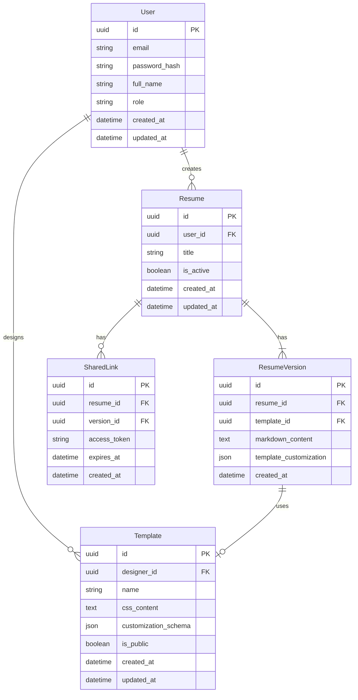

# Entity Relationship Diagram

## Create the List of Tables

1. **User Table**

   - Stores user account information
   - Manages both job seekers and template designers
   - Contains authentication and profile data

2. **Resume Table**

   - Stores basic resume information
   - Links resumes to their owners
   - Tracks active status and metadata

3. **ResumeVersion Table**

   - Stores different versions of resumes
   - Contains the actual markdown content
   - Manages template customization settings

4. **Template Table**

   - Stores resume template designs
   - Contains CSS styling and customization options
   - Tracks template visibility and designer

5. **SharedLink Table**
   - Manages resume sharing functionality
   - Contains access tokens for shared resumes
   - Tracks expiration and creation dates

## Add the Entity Relationship Diagram

### Table Details

#### User Table

| Column Name   | Type     | Description                                 |
| ------------- | -------- | ------------------------------------------- |
| id            | uuid     | Primary key identifier                      |
| email         | string   | User's email address for authentication     |
| password_hash | string   | Hashed password for security                |
| full_name     | string   | User's full name                            |
| role          | string   | User role (job seeker or template designer) |
| created_at    | datetime | Timestamp of account creation               |
| updated_at    | datetime | Timestamp of last update                    |

#### Resume Table

| Column Name | Type     | Description               |
| ----------- | -------- | ------------------------- |
| id          | uuid     | Primary key identifier    |
| user_id     | uuid     | Foreign key to User table |
| title       | string   | Title of the resume       |
| is_active   | boolean  | Whether resume is active  |
| created_at  | datetime | Timestamp of creation     |
| updated_at  | datetime | Timestamp of last update  |

#### ResumeVersion Table

| Column Name            | Type     | Description                       |
| ---------------------- | -------- | --------------------------------- |
| id                     | uuid     | Primary key identifier            |
| resume_id              | uuid     | Foreign key to Resume table       |
| template_id            | uuid     | Foreign key to Template table     |
| markdown_content       | text     | Resume content in markdown format |
| template_customization | json     | Template customization settings   |
| created_at             | datetime | Timestamp of version creation     |

#### Template Table

| Column Name          | Type     | Description                                   |
| -------------------- | -------- | --------------------------------------------- |
| id                   | uuid     | Primary key identifier                        |
| designer_id          | uuid     | Foreign key to User table (template designer) |
| name                 | string   | Template name                                 |
| css_content          | text     | CSS styling for the template                  |
| customization_schema | json     | Available customization options               |
| is_public            | boolean  | Template visibility status                    |
| created_at           | datetime | Timestamp of creation                         |
| updated_at           | datetime | Timestamp of last update                      |

#### SharedLink Table

| Column Name  | Type     | Description                        |
| ------------ | -------- | ---------------------------------- |
| id           | uuid     | Primary key identifier             |
| resume_id    | uuid     | Foreign key to Resume table        |
| version_id   | uuid     | Foreign key to ResumeVersion table |
| access_token | string   | Unique token for sharing           |
| expires_at   | datetime | Link expiration timestamp          |
| created_at   | datetime | Timestamp of link creation         |
